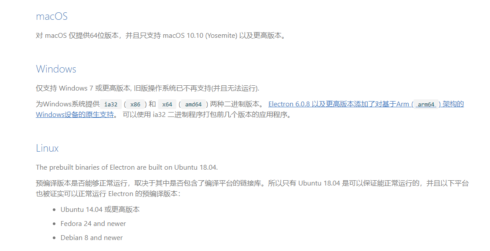
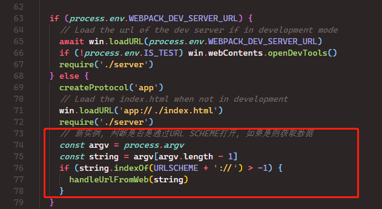

# 如何用Vue开发Electron桌面程序? 这篇就够了!

> 示例项目地址: [github.com/klren0312/e…](https://github.com/klren0312/electronTemplate)

分条查看相关积累知识: [github.com/klren0312/d…](https://github.com/klren0312/daliy_knowledge/issues)

## 一、Electron介绍

Electron 是一个由 GitHub 及众多贡献者组成的活跃社区共同维护的开源项目. 使用 JavaScript，HTML 和 CSS 构建跨平台的桌面应用程序

### 1. 特点

- 跨平台 可以打包成Mac、Windows 和 Linux三个平台的应用程序
- 简化桌面端开发 （1）Electron 基于 Chromium 和 Node.js,可以使用 HTML, CSS 和 JavaScript 构建应用 （2）提供Electron api 和 NodeJS api
- 社区活跃

### 2. 兼容性

> xp无缘了, 可能需要使用nwjs等方案



## 二、项目搭建

### 1. 使用 vue cli 创建vue项目

```bash

vue create electron-test

```

### 2. 安装插件 vue-cli-plugin-electron-builder

```bash

vue add electron-builder

```


### 3. 安装完插件后, 项目中的一些变化

#### ① package.json 新增了几个scripts


```bash

npm run electron:serve  electron开发模式
npm run electron:build   electron打包

```

postinstall 和 postuninstall 是为了确保安装或者移除依赖时, 始终跟electron匹配

#### ② 新增了background.js文件

主进程相关操作, 写在这个文件中


#### ③ 新增了一个环境变量

可以用来判断是否在electron状态

```

process.env.IS_ELECTRON

```

## 三、开发总结

### 1. 配置项目图标

> 参考文档: [nklayman.github.io/vue-cli-plu…](https://nklayman.github.io/vue-cli-plugin-electron-builder/guide/recipes.html)

使用`electron-icon-builder`, 生成符合Electron的图标

① 安装

```bash

npm install --save-dev electron-icon-builder

```

② `package.json` 中配置生成命令

```

"electron:generate-icons": "electron-icon-builder --input=./public/icon.png --output=build --flatten"

```

③ 生成图标

```bash

npm run electron:generate-icons

```

④ 使用

```js

import path from 'path'
const win = new BrowserWindow({
  icon: path.join(__static, 'icon.png')
})

```

### 2. 项目开发模式运行出现 Failed to fetch extension 警告

由于网络问题, 开发模式无法下载 vue devtool 导致的警告, 需要在 background.js 中注释掉下载代码


### 3. 项目使用本地的vue devtools

① 首先可以将vue devtools的代码clone下来, 然后进行编译

```bash

git clone https://github.com/vuejs/vue-devtools.git
cd vue-devtools
npm install
npm run build

```

然后把`vue-devtools/packages/shell-chrome`文件夹复制到项目根目录

② 在`background.js`文件的`app.on('ready',`生命周期中进行加载

```js

// 使用本地的vue开发者工具
session.defaultSession.loadExtension(path.resolve('shell-chrome'))

```

③ 创建窗口的时候使用下面示例方法, 即可正常显示出vue开发者工具

```js

// src/background.js
if (process.env.WEBPACK_DEV_SERVER_URL) {
  await transferWin.loadURL(
    process.env.WEBPACK_DEV_SERVER_URL + '/#/test'
  )
  if (!process.env.IS_TEST) transferWin.webContents.openDevTools()
} else {
  transferWin.loadURL('app://./index.html' + '/#/test')
}

```

### 4. 渲染进程中如何使用NodeJS api

需要在 vue.config.js 中配置 nodeIntegration 为 true

```js

module.exports = {
  pluginOptions: {
    electronBuilder: {
      nodeIntegration: true
    }
  }
}

```

或者在创建窗口时配置

```js

win = new BrowserWindow({
    width: 500,
    height: 400,
    frame: false,
    transparent: true,
    backgroundColor: '#00000000', // 当关闭开发者工具时, 会重新创建一个新的渲染视图, 所以会使用配置的背景颜色, 如果没配置会使用默认值白色
    webPreferences: {
      nodeIntegration: true, // 渲染层可以使用node
      webSecurity: false, // 跨域
      enableRemoteModule: true // 可以使用remote
    },
    // eslint-disable-next-line no-undef
    icon: path.resolve(__static, 'logo.png')
  })

```

### 5. 让创建的窗口可以跨域

创建窗口的时候配置 `webSecurity: false`即可

### 6. 如何监听窗口的状态, 最小化, 聚焦, 窗口隐藏, 窗口显示, 窗口关闭

```js

// 窗口最小化触发
win.on('minimize', () => {
  console.log('最小化')
})
win.on('focus', () => {
  console.log('聚焦')
})
// 窗口隐藏, 任务栏没有图标
win.on('hide', () => {
  console.log('隐藏')
})
win.on('show', () => {
  flashTray(false)
  console.log('显示')
})

```

### 7. 如何创建托盘图标

> 参考文档: [www.electronjs.org/docs/api/tr…](https://www.electronjs.org/docs/api/tray)

```js

let tray = null
function createTray () {
  tray = new Tray(path.resolve(__static, ‘logo.png’)) // 设置托盘图标
  const contextMenu = Menu.buildFromTemplate([
     new MenuItem({
      label: '退出程序',
      click: () => {
        isQuit = true
        app.exit()
      }
    })
  ])
  tray.setContextMenu(contextMenu) // 设置右键菜单
  tray.on(‘click’, () => { // 托盘点击事件
    if (win.isVisible()) {
      win.focus()
    } else {
      win.show()
    }
  })
}

```

监听主窗口的关闭, 如果不是完全退出, 则只是隐藏窗口

```js

win.on('close', e => {
    if (isQuit) {
      win = null
    } else {
      e.preventDefault()
      win.hide()
    }
})

```

### 8. 托盘闪烁与任务栏闪烁


① 托盘闪烁原理就时定时的切换托盘的图标, 图标与透明图标的切换

```js

let flashInterval
function flashTray (bool) {
  if (!bool) {
    flashInterval && clearInterval(flashInterval)
    tray.setImage(path.resolve(__static, 'logo.png'))
    return
  }
  flashInterval && clearInterval(flashInterval)
  var count = 0
  flashInterval = setInterval(function() {
    if (count++ % 2 == 0) {
      tray.setImage(path.resolve(__static, 'empty.png'))
    } else {
      tray.setImage(path.resolve(__static, 'logo.png'))
    }
  }, 400)
}

```

② 任务栏的闪烁

```js

win.flashFrame(true) // 高亮

```

### 9. 如何只运行单个实例

> 参考文档: [www.electronjs.org/docs/api/ap…](https://www.electronjs.org/docs/api/app)

如果你的程序是应用的主要实例并且当app.requestSingleInstanceLock()返回true时，你应该继续让你的程序运行。如果当它返回 false, 那就立即退出

```js

const gotTheLock = app.requestSingleInstanceLock()
if (!gotTheLock) {
  app.quit()
} {
  app.on('second-instance', (event, argv) => {
    if (process.platform === 'win32') {
      if (win) {
        if (win.isMinimized()) {
          win.restore()
        }
        if (win.isVisible()) {
          win.focus()
        } else {
          win.show()
        }
      }     }
  })
}

```

### 10. 主进程与渲染进程如何通信

> 参考文档:

ipcMain ipcRenderer

① 渲染进程

```javascript

const {ipcRenderer} = require('electron')
ipcRenderer.send('message', 'ping') // 发送给主进程
ipcRenderer.on('message-reply', (event, arg) => {
  console.log(arg) // pong
}

```

② 主进程

```js

// 监听渲染进程信息
ipcMain.on('message', (event, arg) => {
  console.log('ping')
  event.sender.send('message-reply', 'pong') // 回复子程序
})
// 主进程单独往渲染进程发信息
win.webContents.send('message-reply', 'pong')

```

### 11. 打包问题

> 参考文档: [www.electron.build/configurati…](https://www.electron.build/configuration/nsis)

使用nsis打包windows程序的安装包 在 vue.config.js 中配置打包配置

```js

module.exports = {
  pluginOptions: {
    electronBuilder: {
      builderOptions: {
        win: {
          target: [{ target: 'nsis', arch: ['ia32', 'x64'] }]
        },
        nsis: {
          oneClick: false, // 一键安装
          perMachine: true, // 为所有用户安装
          allowElevation: true, // 允许权限提升, 设置 false 的话需要重新允许安装程序
          allowToChangeInstallationDirectory: true, // 允许更改安装目录
          createDesktopShortcut: true, // 创建桌面图标
          createStartMenuShortcut: true, // 创建开始菜单
          deleteAppDataOnUninstall: true,
          include: './public/nsis/installer.nsh', // 包含的脚本
          guid: '53fe4cba-120d-4851-3cdc-dccb3a469019' // 软件guid
        }
      }
    }
  }
}

```

### 12. 从网页打开程序

① 主进程注册

```js

app.removeAsDefaultProtocolClient(‘testapp’)
app.setAsDefaultProtocolClient(‘testapp’)

```

② 在nsis打包配置文件(installer.nsh)中添加配置 在安装的时候在注册表注册URL protocol


```js

!macro customInstall
  DetailPrint 'Register testapp URI Handler'
  DeleteRegKey HKCR 'testapp'
  WriteRegStr HKCR 'testapp' '' 'URL:testapp'
  WriteRegStr HKCR 'testapp' 'URL Protocol' ''
  WriteRegStr HKCR 'testapp\shell' '' ''
  WriteRegStr HKCR 'testapp\shell\Open' '' ''
  WriteRegStr HKCR 'testapp\shell\Open\command' '' '$INSTDIR\${APP_EXECUTABLE_FILENAME} %1'
!macroend

```

③ 直接在浏览器访问链接即可触发打开客户端 testapp://?参数=值 


④ 获取网页端传来的参数

```js

// window 系统中执行网页调起应用时，处理协议传入的参数
const handleArgvFromWeb = (argv) => {
  console.log(argv)
  const url = argv.find(v => v.indexOf(`${URLSCHEME}://`) !== -1)
  console.log(url)
  if (url) handleUrlFromWeb(url)
}
// 进行处理网页传来 url 参数，参数自定义，以下为示例
// 示例调起应用的 url 为 testapp://?token=205bdf49hc97ch4146h8124h8281a81fdcdb
const handleUrlFromWeb = (urlStr) => {
  console.log(urlStr)
  const urlObj = new URL(urlStr)
  const { searchParams } = urlObj
  const token = searchParams.get('token')
  console.log(token)
}

```

可以看到获取的参数是个数组, 我们就时要获取最后一项


生产模式下, 如果软件没有提前打开, 通过网页开启时, 需要按照下图方式来获取参数 



若提前开启, 则在判断单例的条件判断中获取 


### 13. 安装依赖或打包时出现electron包下载过慢问题

根目录创建 .npmrc 文件

```bash

registry = https://registry.npm.taobao.org
 
sass_binary_site = https://npm.taobao.org/mirrors/node-sass/
phantomjs_cdnurl = http://cnpmjs.org/downloads
electron_mirror = https://npm.taobao.org/mirrors/electron/
sqlite3_binary_host_mirror = https://foxgis.oss-cn-shanghai.aliyuncs.com/
profiler_binary_host_mirror = https://npm.taobao.org/mirrors/node-inspector/
chromedriver_cdnurl = https://cdn.npm.taobao.org/dist/chromedriver

```

### 14. 通过外面浏览器打开链接

```js

const { shell } = require('electron')
shell.openExternal('https://www.bing.com')

```

### 15. 开发模式如果打开窗口时, 若开启了开发者工具, 想关闭窗口, 需要先把开发者工具关闭, 才能正常关闭窗口

在窗口关闭前, 判断开发者工具是否开启, 若开启则先关闭开发者工具, 例如

```js

if (callWin.isDevToolsOpened()) {
  callWin.closeDevTools()
}

```

### 16. 透明无边框窗口, 接触到屏幕边缘会出现黑色边框问题

> 参考资料: [github.com/electron/el…](https://github.com/electron/electron/issues/15947)

主要就是创建窗口时添加延时,

```js

setTimeout(() => createWindow(), 400)

```

然后关闭硬件加速

```js

app.disableHardwareAcceleration()
app.commandLine.appendSwitch('disable-gpu')
app.commandLine.appendSwitch('disable-software-rasterizer')

```

### 17. 透明无边框窗口, 当关闭开发者工具时, 背景会变白色问题

> 参考资料: [github.com/electron/el…](https://github.com/electron/electron/issues/10420#issuecomment-329964500)

当关闭开发者工具时, 会重新创建一个新的渲染视图, 所以会使用配置的背景颜色, 如果没配置会使用默认值白色 所以需要在窗口创建时设置`backgroundColor`属性为`#00000000`

### 18. 渲染进程获取主进程环境变量

> [github.com/electron/el…](https://github.com/electron/electron/issues/5224#issuecomment-212279369)

```javascript

const { remote } = require('electron')
const envData = remote.getGlobal('process').env

```

### 19. 打包时, 报错asar文件被占用

vscode可以再setting.json里配置忽略dist_electron文件夹

```js

"files.exclude": {
  "dist_electron": true,
}

```

### 20. 软件更新

使用`electron-updater`

① 配置`vue.config.js` 设置`publish`配置, 配置了这个配置后, 打包后会生成一个`latest.yml`文件, 需要将其和安装包放在服务器同一目录下, `url`配置成服务器可以访问到这个目录的url, 也可以使用`autoUpdater.setFeedURL(url)`动态配置url

```javascript

pluginOptions: {
  electronBuilder: {
    builderOptions: {
      publish: [
        {
          provider: 'generic',
          url: 'http://127.0.0.1:5000'
        }
      ]
    }
  }
}

```

② 类似示例 [github.com/electron-us…](https://github.com/electron-userland/electron-builder/blob/docs/encapsulated manual update via menu.js)

### 21. electron win7问题

① win7 sp1 or win8 needed install KB4019990 patch to resolve this issue for now（note：none sp1 win7 needed to upgrade to sp1 before install the patch） 需要安装补丁解决黑屏问题 [github.com/electron/el…](https://github.com/electron/electron/issues/25186)

② 升级.net [github.com/electron/el…](https://github.com/electron/electron/issues/19569)

③ 关闭硬件加速 [github.com/electron/el…](https://github.com/electron/electron/issues/20702#issuecomment-637156596)

### 22. 7z解压asar插件

目前我用asar命令行解压会报错, 但是用7z的插件虽然报错, 却可以完整解压 插件地址: [www.tc4shell.com/en/7zip/asa…](https://www.tc4shell.com/en/7zip/asar/)


下载好, 把dll复制到7z安装目录下新建一个`Formats`文件夹中


## 四、参考文档

1. [vue-cli配置](https://cli.vuejs.org/config/)
2. [electron api文档](https://www.electronjs.org/docs/api)
3. [vue-cli-plugin-electron-builder](https://github.com/nklayman/vue-cli-plugin-electron-builder)
4. [electron-build文档](https://www.electron.build/)
5. [electron-updater文档](https://www.electron.build/auto-update.html)