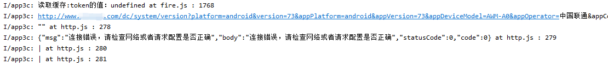
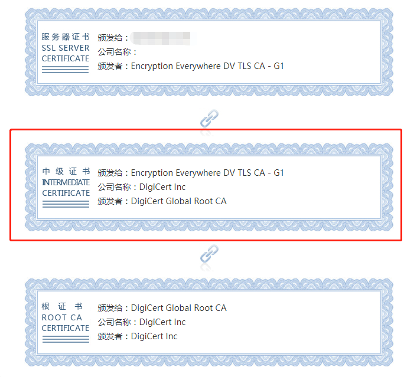
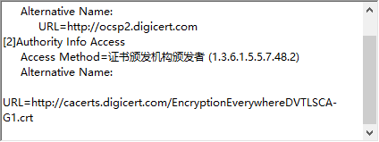
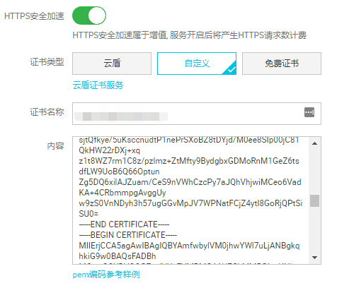

最后更新时间: 2020年11月28日 22:45:37

# 迁移服务器造成SSL证书链不完成引起安卓端请求异常的问题

## 说明

请求在IOS端PC端安卓端都能正常访问,但安卓端直接发送请求会请求失败

## 操作

客户对服务器进行了迁移,由内网服务器迁移至外网华为云,在迁移中SSL证书链丢失.
在使用SSL证书在线检测工具后，发现原来是缺少中间证书的问题.

## 原因

APP端请求默认是走https协议的。在跨服务商跨系统的迁移后端服务器时，打包证书文件遗漏了中间证书，导致证书链不完整，在部分安卓系统下证书不可信从而导致无法请求到数据。为什么就安卓系统会出现这个问题？在证书文件的详细信息-授权信息访问一栏的Alternative Name中指定了中间证书的获取URL地址。IOS、MAC、Windows、都支持这种方式获取中间证书，唯独部分Android系统不支持，所以就无法建立可信连接.

## 解决方法

解决方法，就是迁移服务器时一定要注意证书文件pem/crt以及私钥文件key的完整性。中间证书一定要加在根证书后面。如下图的阿里云CDN-HTTPS安全加速，一定要把根证书文件和中间证书文件都复制到内容里。

另外，选择ssl服务商时，尽量选择可靠的服务商，更换或续费重签证书时，也尽量检查是否更换过中间证书。以防导致线上产品出现只在部分情况下才会复现的BUG问题。
